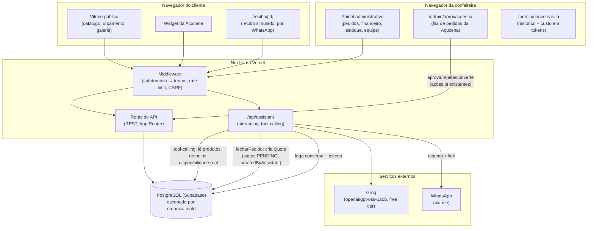

## O projeto em três linhas

A Açucena é a assistente de IA de um SaaS multi-tenant para confeitarias artesanais, cujo primeiro tenant é a Confeitaria Cinthia Rodrigues — um negócio real, com catálogo e marca reais, mas que ainda não usa o sistema no dia a dia (não é um case fictício, mas também não é uma operação real em andamento). Ela responde dúvidas sobre cardápio, sabores e prazos com dados reais do catálogo, recomenda por necessidade descrita e fecha pedidos de ponta a ponta — sempre sob aprovação humana obrigatória antes de qualquer coisa virar negócio de verdade.

## O que é real neste projeto, e o que ainda não é

O código está implantado e funcionando de verdade em produção (não é um protótipo local): banco de dados real, deploy real, o site público está no ar. O negócio (Confeitaria Cinthia Rodrigues) e o catálogo também são reais. O que ainda não é real: a confeiteira ainda não usa o sistema no dia a dia -- quem testou a Açucena até agora fui eu, o desenvolvedor, direto no site em produção. Isso já foi suficiente pra achar problemas que um ambiente de demonstração dificilmente revelaria: um bug de data causado pelo modelo assumindo o ano errado, um timeout de 30s do provedor de IA sem erro visível, uma lacuna real de notificação, e um consentimento LGPD assumido por padrão sem nunca ter sido pedido. Cada um virou uma correção revisada, testada e publicada em produção no mesmo dia em que foi descoberto.

## Arquitetura

*(diagrama completo e sempre atualizado em [`docs/arquitetura.md`](https://github.com/allahensus/crconfeitaria/blob/main/docs/arquitetura.md) do repositório)*

- **Um único agente**, sem sub-agentes, com cinco ferramentas: três somente-leitura (catálogo, recheios, disponibilidade), uma de encaminhamento (resumo por WhatsApp) e uma que escreve no banco (`fecharPedido`) — sempre criando um pedido `PENDING`, nunca confirmado sozinho.
- **Onde o humano entra:** todo pedido criado pela Açucena cai numa fila de aprovação dedicada (`/admin/aprovacoes-ia`); só vira pedido de verdade quando a confeiteira aprova e converte.
- **Preço nunca vem do modelo:** a ferramenta de fechamento sempre recalcula o valor a partir do catálogo real no banco — o modelo não tem como inflar ou inventar um preço.
- **Documento e pagamento simulados:** pagamento é uma ação manual da confeiteira (inclusive um modo "Simulado" para demonstração, sem dinheiro real); o recibo é uma página HTML pública, com controle de acesso por WhatsApp, sempre identificado como simulado.

## Stack

- **Next.js 15 (App Router) + TypeScript + Prisma/PostgreSQL (Supabase)**, multi-tenant por subdomínio.
- **Vercel AI SDK** com tool-calling, rodando hoje em produção com **Groq** (`openai/gpt-oss-120b`, free tier) — trocado do **Google Gemini** no mesmo dia em que o free tier dele causou instabilidade real em produção (limite de taxa, descontinuação de modelo, timeout de 30s sem erro visível). A troca foi testada em branch isolada com preview antes do merge.
- **Vitest** para testes de integração contra banco real (não mockado) — inclusive os testes dos guardrails de segurança (preço nunca vindo do modelo, aprovação nunca pulada, consentimento LGPD nunca assumido).

## O harness: Claude Code

Todo o desenvolvimento -- desde o discovery inicial até cada correção de bug em produção -- foi feito com **Claude Code**, seguindo um fluxo estruturado:

- **Brainstorm → spec → plano → implementação**, com specs e ADRs documentados em `docs/` antes de qualquer código.
- **Subagent-Driven Development** para features maiores: um subagente implementador por tarefa, revisão dedicada depois de cada uma, e uma revisão final de toda a branch antes do merge -- essa revisão final pegou 6 problemas reais que nenhuma revisão por tarefa isolada teria visto (ex: um endpoint público conseguia forjar o campo que identifica um pedido como criado pela IA).
- **`main` protegida** no GitHub, exigindo Pull Request e CI verde para qualquer mudança -- nem as correções mais urgentes puladas direto pra produção.

## As três decisões de engenharia mais difíceis

1. **Deixar o agente escrever no banco, mas nunca decidir sozinho.** A decisão original (ADR 0004) era o assistente nunca criar nada -- só responder e encaminhar por WhatsApp. Reverter isso (ADR 0006) significou desenhar uma ferramenta que cria um pedido real, mas com o preço sempre recalculado do catálogo (nunca aceito do modelo) e status sempre `PENDING` (aprovação humana nunca pulável) -- a decisão foi sobre *onde* colocar a fronteira entre "a IA decide" e "a IA propõe", não se colocar essa fronteira.
2. **Trocar o provedor de IA em produção sem discovery formal, a partir de um bug real.** O Gemini free tier travou (timeout de 30s, sem erro visível) durante um teste ao vivo no site em produção. Em vez de só documentar o limite conhecido, testamos Groq como alternativa na hora -- branch isolada, preview, validação -- decisão tomada com dado real de custo (menos de $5/mês no volume esperado) em vez de suposição.
3. **Corrigir uma suposição de consentimento LGPD que ninguém tinha pedido para eu verificar.** O `createQuote` assumia consentimento (`lgpdAccepted: true`) por padrão sempre que o campo não era enviado -- inofensivo no formulário público (que sempre envia o valor real de um checkbox visível), mas silenciosamente errado no fluxo da Açucena, que nunca coletava esse campo. Descobrir isso não veio de um requisito explícito -- veio de uma pergunta direta do cliente sobre como o pedido chegava até a confeiteira, que puxou o fio até um problema de conformidade real.

## Como tratei os medos do cliente

- **"Vai gastar dinheiro?"** -- Medida com dado real: 4 conversas reais registradas, ~2.700 tokens/conversa em média, projeção de menos de $5/mês num mês bem movimentado no tier pago (o free tier já cobre isso hoje).
- **"Vai inventar preço ou prometer coisa que não pode cumprir?"** -- Nunca: preço sempre vem do catálogo real, disponibilidade de data é sempre consultada em tempo real, e toda resposta deixa claro que a confirmação final é humana.
- **"Vou ficar sabendo se um cliente fizer um pedido?"** -- Descoberto como lacuna real durante teste ao vivo (o pedido só aparecia numa fila administrativa, sem nenhum aviso ativo) -- corrigido no mesmo dia com um link de WhatsApp que o próprio cliente envia pra confeiteira, sem custo nem infraestrutura nova.

## O que aprendi

A parte mais difícil desse desafio não foi técnica. Foi resistir à vontade de deixar a IA decidir mais coisas sozinha do que ela devia. É tentador — dá pra fazer o agente confirmar o pedido, cobrar, prometer a data, tudo numa tacada só, e parece mais "mágico". Mas quanto mais eu mexia nisso, mais claro ficava que o valor real não estava em automatizar tudo, e sim em automatizar só o que pode ser automatizado com segurança, e deixar bem marcado onde o humano tem que entrar. Isso valeu tanto pra decisão de arquitetura (preço nunca vindo do modelo, pedido sempre `PENDING` até aprovação) quanto pro jeito de conduzir o projeto inteiro.

A outra coisa que aprendi, e que não esperava aprender assim: os problemas mais sérios não apareceram enquanto eu escrevia código ou lia spec. Apareceram quando parei de testar em teoria e comecei a usar o produto de verdade, no site em produção, prestando atenção no que uma pessoa comum perguntaria. Foi uma pergunta simples e direta — "isso vai pro WhatsApp da confeiteira?" — que puxou o fio até uma lacuna real de notificação. E foi outra pergunta igualmente simples — "e o cadastro, e a LGPD?" — que revelou que o sistema estava assumindo consentimento que ninguém tinha dado. Nenhuma dessas duas coisas estava em nenhuma spec, nenhum ADR, nenhum plano. Elas só apareceram porque alguém usou o produto como cliente usaria, e perguntou o que um cliente perguntaria.

Se eu fosse resumir o aprendizado de todos os desafios até aqui, seria isso: a dor do cliente raramente está inteira no pedido inicial. Ela aparece aos poucos, enquanto você mostra o que construiu e alguém reage de verdade. O trabalho de engenharia não termina quando o código compila ou quando os testes passam — termina quando alguém usa e você escuta com atenção o que a reação da pessoa está te dizendo sobre o que ainda falta.
