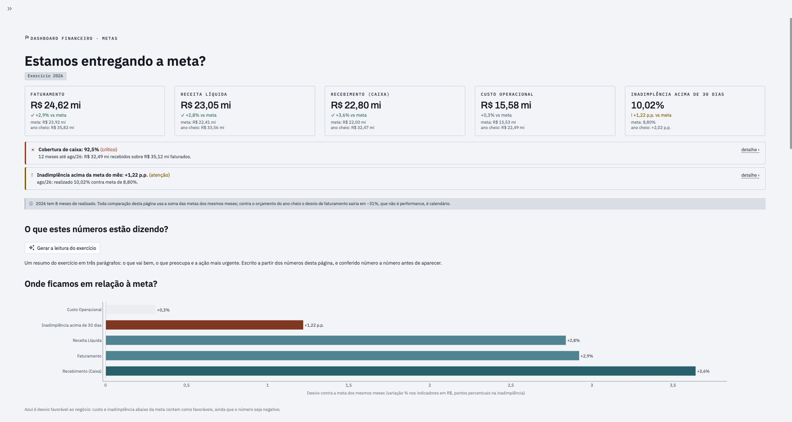
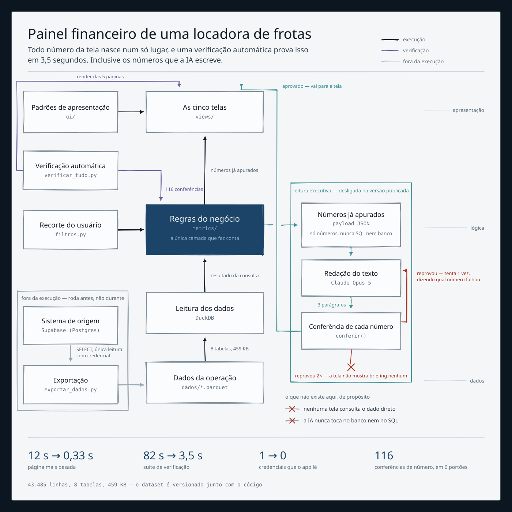

# Dashboard Financeiro Locadores de Frotas

> **O modelo de linguagem decide o que dizer. O código decide o que pode ser feito.**

**Aviso antes de tudo: este não é o agente de vendas do desafio.** É um painel
financeiro. Está aqui porque a regra acima, que costura o desafio inteiro, é a única coisa
que este projeto implementa de forma literal e verificável.

## O que é

Um painel de cinco páginas para o financeiro de uma locadora de frotas B2B. Cada tela
responde **uma** pergunta de negócio, declarada no próprio título: *Estamos entregando a
meta? Quanto faturamos e quanto entrou em caixa? Quanto está em aberto hoje, e com quem?
Para onde vai o custo?*

Dataset sintético de 32 meses. O painel está no ar em
[dashboard-financeiro-rdev.streamlit.app](https://dashboard-financeiro-rdev.streamlit.app).



## A tese saiu dos números, não do briefing

Em 2025 a empresa bateu a meta de faturamento estourando a de custo, e o caixa fechou
negativo no mesmo ano em que a receita foi positiva.

| Exercício | Faturamento | Recebimento | Custo | Inadimplência acima de 30 dias |
|---|---|---|---|---|
| 2024 | −2,7% | −4,7% | −2,1% | 3,56% *(meta 3,00%)* |
| 2025 | **+6,8%** | −2,9% | **+8,2%** | **10,20%** *(meta 3,00%)* |
| 2026 *(8 meses)* | +2,9% | +3,6% | +0,3% | 10,02% *(meta 8,00%)* |

**A crise é de crédito, não de receita.** E o painel expõe a causa: um cliente D erra 25
vezes mais que um A (16,94% contra 0,67%), mas os clientes C têm o maior limite médio da
base, 50% acima dos A. O limite de crédito nunca foi calibrado pelo risco.

## A IA escreve o briefing. E não pode inventar número.

A página de Metas tem um botão que gera, pela API do Claude, a leitura do exercício em
três parágrafos: o que vai bem, o que preocupa, a ação mais urgente.

**O modelo não tem acesso a dado nenhum.** Ele não vê SQL, não vê os arquivos e não
calcula. Recebe um dicionário com números que a camada semântica já apurou.

E isso não é promessa, é verificação. `frotas/leitura.py` extrai **todo token numérico do
texto gerado** e exige que cada um corresponda a um valor do payload, com a tolerância de
arredondamento do próprio texto: `92,5%` casa com `92,5126`, mas `R$ 3,52 mil` não casa
com `R$ 3,52 mi`. Um número sem procedência **reprova a resposta inteira**. O app tenta uma
vez mais dizendo qual número reprovou e, falhando de novo, não mostra briefing nenhum.

Um briefing com número inventado é pior que briefing nenhum: ele parece conferido, e
ninguém confere de novo.

## Arquitetura



Uma direção só, sem volta:

```
views/  ->  frotas.metrics.*  ->  frotas.db.consultar  ->  DuckDB sobre dados/*.parquet
```

**O app não conecta em banco nenhum.** Lê oito arquivos Parquet de 459 KB versionados no
próprio repositório, consultados pelo DuckDB em processo. Não há servidor, não há rede e
não há credencial: `git clone` e `pip install` e o painel roda.

| Peça | Escolha | Por quê |
|---|---|---|
| Interface | Streamlit 1.50 | uma pessoa entrega painel de produção sem front-end separado |
| Consulta | DuckDB sobre Parquet | roda o mesmo SQL que rodava no Postgres, em processo |
| Gráficos | Plotly | controle fino de eixo, anotação e hover, que é onde a honestidade do gráfico mora |
| Leitura executiva | API do Claude | interpreta e prioriza; não calcula |

## As seis invariantes, verificadas por máquina

Não são combinados de equipe. São portões que reprovam o build:

- Só `frotas/metrics/` escreve SQL
- A UI não conhece limiar: nível e cor de alerta vêm da camada de métricas
- A UI não inventa cor: zero hexadecimal fora do arquivo de tema
- Todo número passa por um formatador único, inclusive os separadores do Plotly
- Nenhum nome de coluna do banco chega à tela
- Nenhum número sem procedência chega à tela, inclusive os de texto gerado por modelo

`python3 scripts/verificar_tudo.py` roda os seis em 3,5 segundos, e o GitHub Actions roda o
mesmo comando a cada push e a cada pull request, numa máquina limpa.

## O harness

Construído com **Claude Code**, em par. O arquivo de contexto é o `CLAUDE.md` da raiz: as
camadas, as invariantes, o vocabulário de tela, as armadilhas do dataset e o que nunca
fazer.

**O que ficou automatizado para o agente.** As seis verificações são a fronteira: nada se
considera pronto sem elas verdes. E três decisões de projeto tiram do agente a chance de
errar sozinho: toda cor num arquivo só, todo rótulo num dicionário só, todo número num
formatador só.

**O que deliberadamente não ficou na mão dele.** Escopo, prioridade, vocabulário de tela e
toda decisão de negócio. O corte point-in-time e a comparação de meta por período casado
foram decisões de quem conhece o negócio, não sugestões aceitas. Propostas foram
revertidas: as barras de peso das tabelas voltaram ao componente nativo depois de uma
versão customizada que não ficou mais legível.

**Como a saída é revisada.** Os portões pegam só o que alguém já aprendeu a checar. Dois
defeitos passaram por eles e caíram na leitura humana: um gráfico de risco plotava uma
coluna parecida com a certa e mostrava 34 clientes críticos onde a regra apontava 8; e um
gráfico morto chegou à produção porque o portão de render ignorava `st.warning`. O segundo
virou portão novo, provado **reintroduzindo o defeito** antes de merecer confiança.

## As três decisões mais difíceis

**1. Filtro point-in-time de cancelamento.** Um título cancelado hoje não pode ser
inadimplente numa foto de antes do cancelamento.
*Alternativa descartada:* aplicar o status atual sobre a série inteira, que é uma consulta
mais simples e mais rápida.
*Consequência aceita:* toda consulta de inadimplência carrega a data de referência e fica
mais cara. Sem isso, o indicador central sairia **18,7% em vez de 9,4%**.

**2. Trocar a conexão viva por snapshot local, sem reescrever SQL.**
*Alternativa descartada:* reescrever a camada semântica em pandas.
*Consequência aceita:* duas diferenças de dialeto tiveram que ser resolvidas de forma
portável. Em troca, as 116 verificações que validam exatamente aquele SQL continuaram
válidas, a página mais pesada caiu de 12 s para 0,33 s e o deploy deixou de ter
credencial.

**3. A leitura executiva reprova a si mesma.**
*Alternativa descartada:* mostrar o texto com um aviso de "gerado por IA, confira os
números".
*Consequência aceita:* às vezes o usuário clica e não recebe briefing nenhum. É o preço de
nunca colocar na tela um número que ninguém pode rastrear.

## O que eu aprendi

**Portão que nunca falhou não é portão.** Os seis nasceram de defeitos que passaram, um de
cada vez. Quando escrevi o portão que impede travessão em prosa, provei reintroduzindo o
defeito antes de confiar nele. Foi a única forma de saber que ele enxergava.

**As verificações só pegam o que você já aprendeu a checar.** O gráfico que plotava a
coluna errada passou por seis portões. Mostrava 34 clientes em nível crítico onde a regra
sinalizava 8, e nenhuma máquina viu. Ferramenta não substitui alguém que conhece o número
esperado.

**Nomear em português de negócio foi mais difícil que o SQL.** "Inadimplência acima de 30
dias" em vez de `inadimplencia_pct` parece detalhe até você perceber que um script precisa
reprovar o build quando um nome de coluna escapa para a tela, porque ele escapa sempre.

**A armadilha mais cara não é técnica, é de leitura.** Comparar 8 meses realizados contra o
orçamento do ano cheio dá −31% de faturamento. O mesmo dado, contra a meta dos mesmos oito
meses, dá +2,9%. A diferença entre "estamos afundando" e "estamos acima da meta" era
calendário.

**O que eu faria diferente.** Ligaria a integração contínua no primeiro dia: ela encontrou,
em minutos, uma dependência que a suíte usava e que ninguém tinha declarado, invisível
enquanto tudo rodava só na minha máquina. E batizaria o case desde o começo, com nome de
empresa e de cliente. Escrever "a locadora" por 32 meses de dados deixa a documentação mais
abstrata do que ela precisava ser, e a regra da galeria está certa em cobrar isso.
